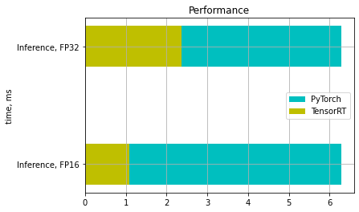
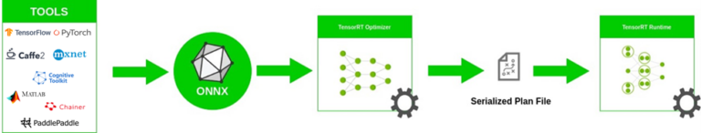
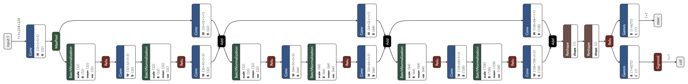
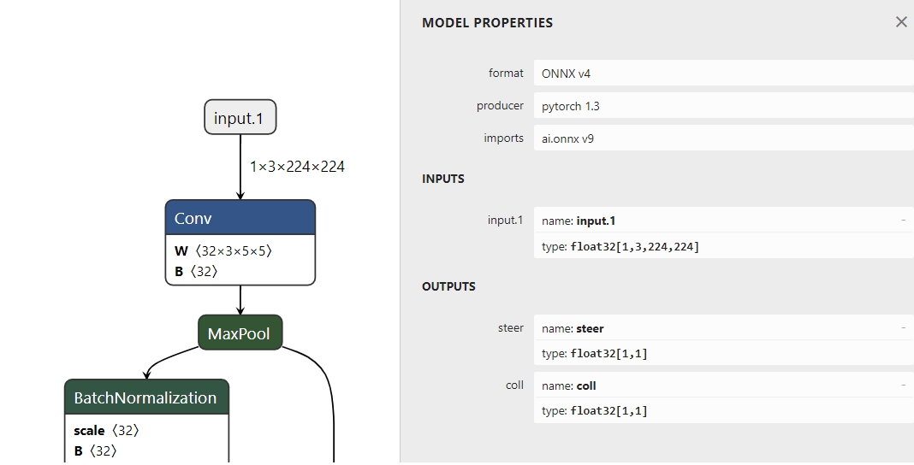
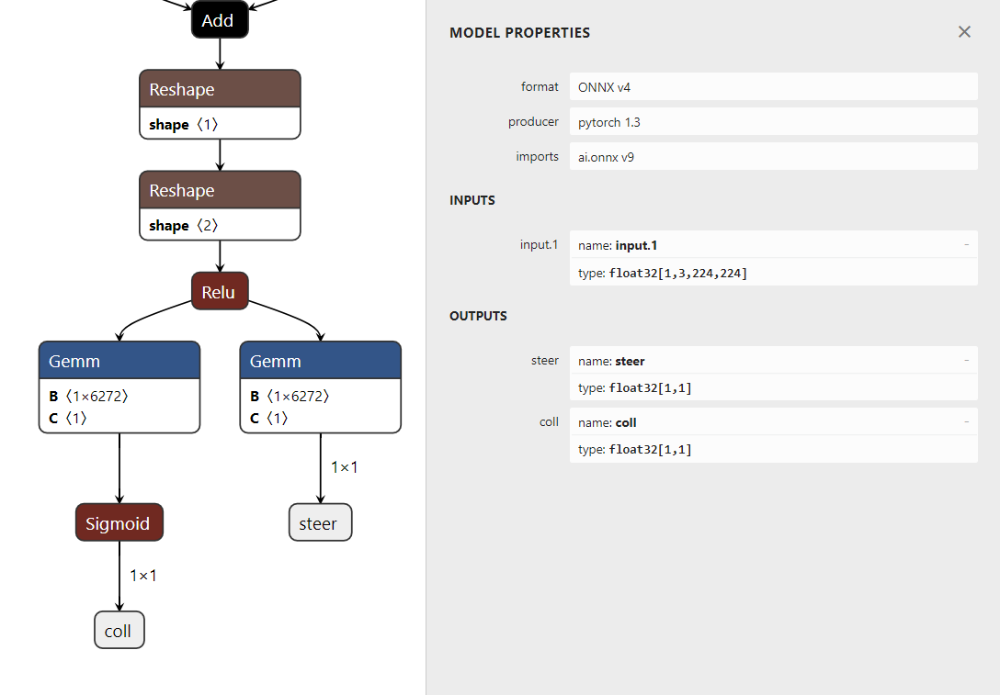
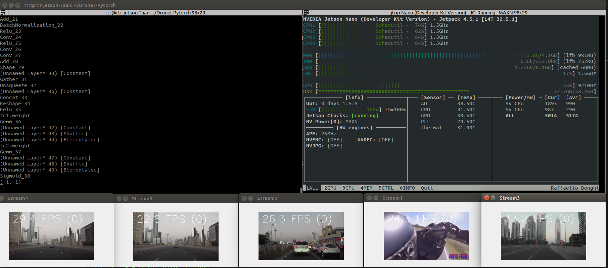
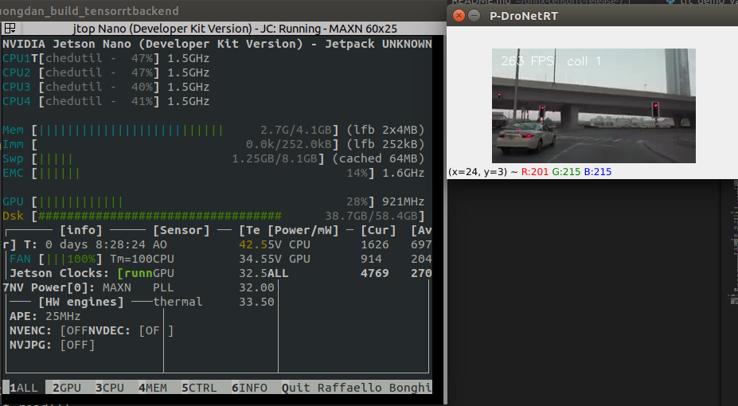

# **<div align='center'> <font size ="6"> Build and Inference TensorRT on Jetson </font> </div>**


```
├── README.md
├── Picture                 
├── .git
├── install_pycuda.sh                     
├── h52onnx.py
├── demo_inference_enigne_PDronet.py        Demo inference engine TensorRT
├── demo_inference_enigne_multithread.py 
├── model
│   ├── dronet.onnx       
│   ├── dronet.trt      
│   ├── dronet.h5 

```

---

## Table of contents
- [TensorRT](#tensorrt)
- [Inference onnx model with TensorRT backend](#inference-onnx-model-with-tensorrt-backend)
- [Work Results](#work-results)
- [Inference engine TensorRT](#inference-engine-tensorrt)


---
# **TensorRT**

<div align="justify" >
&nbsp;&nbsp;&nbsp;&nbsp;&nbsp;<a href='https://docs.nvidia.com/deeplearning/tensorrt/developer-guide/index.html'>Tensorrt</a> TensorRT is a library developed by NVIDIA for faster inference on NVIDIA graphics processing units (GPUs). TensorRT is built on CUDA, NVIDIA’s parallel programming model. It can give around 4 to 5 times faster inference on many real-time services and embedded applications. While as per the documentation, It does give 40 times faster inference as compared to CPU only performance.
</div>


<div align="center">
  
  <div class="bottom-left" ><em> Compare PyTorch and TensorRT </em></div>
</div>

<br></br>


## **What is ONNX?**

&nbsp;&nbsp;&nbsp;&nbsp;&nbsp;<a href='https://onnx.ai/'>ONNX</a> is an open format for ML models, allowing you to interchange models between various ML frameworks and tools.

</div>

<div align="center">
  
  <div class="bottom-left" ><em> ONNX workflow. </em></div>
</div>

<br></br>

* **Visualize ONNX Model**

Visualizing your Neural Network with Netron

**Install netron:**

        $ python3 -m pip install netron
        $ netron

<div align="center">
  
  <div class="bottom-left" ><em>full network graph of Dronet.onnx model </em></div>
</div>

<br></br>

## **Để Inference model Dronet trên TensorRT ta làm theo các bước sau:**
* Step 1: Convert model to onnx
* Step 2: Convert model to engine TensorRT
* Step 3: Load input with engine TensorRT and Inference

<br></br>

---
## **How to convert Pytorch model to onnx**

**In this tutorial I will using .h5 model for Dronet**

* ### **Step 1**: Load your model with pytorch 

```
import torch
import torch.onnx
from torch import nn
from torchsummary import summary

IN_CHANNELS = 1
IMG_WIDTH = 200
IMG_HEIGHT = 200

class ResNet8(nn.Module):
    def __init__(self):
        super(ResNet8, self).__init__()
        # Input
        self.conv1 = nn.Conv2d(IN_CHANNELS, 32, kernel_size=5, stride=2, padding=5//2)
        self.mp1 = nn.MaxPool2d(3, stride=2)

        # First residual block
        self.bn1 = nn.BatchNorm2d(32)
        self.act1 = nn.ReLU()
        self.conv2 = nn.Conv2d(32, 32, kernel_size=3, stride=2, padding=3//2)
        nn.init.kaiming_normal_(self.conv2.weight)

        self.bn2 = nn.BatchNorm2d(32)
        self.act2 = nn.ReLU()
        self.conv3 = nn.Conv2d(32, 32, kernel_size=3, padding=3//2)
        nn.init.kaiming_normal_(self.conv3.weight)

        self.conv4 = nn.Conv2d(32, 32, kernel_size=1, stride=2, padding=1//2)

        # Second residual block
        self.bn3 = nn.BatchNorm2d(32)
        self.act3 = nn.ReLU()
        self.conv5 = nn.Conv2d(32, 64, kernel_size=3, stride=2, padding=1)
        nn.init.kaiming_normal_(self.conv5.weight)

        self.bn4 = nn.BatchNorm2d(64)
        self.act4 = nn.ReLU()
        self.conv6 = nn.Conv2d(64, 64, kernel_size=3, padding=1)
        nn.init.kaiming_normal_(self.conv6.weight)

        self.conv7 = nn.Conv2d(32, 64, kernel_size=1, stride=2, padding=0)

        # Third residual block
        self.bn5 = nn.BatchNorm2d(64)
        self.act5 = nn.ReLU()
        self.conv8 = nn.Conv2d(64, 128, kernel_size=3, stride=2, padding=1)
        nn.init.kaiming_normal_(self.conv8.weight)

        self.bn6 = nn.BatchNorm2d(128)
        self.act6 = nn.ReLU()
        self.conv9 = nn.Conv2d(128, 128, kernel_size=3, padding=1)
        nn.init.kaiming_normal_(self.conv9.weight)

        self.conv10 = nn.Conv2d(64, 128, kernel_size=1, stride=2, padding=0)

        self.fc1 = nn.Linear(6272, 1) #Dense

        self.act7 = nn.ReLU()               #ReLU

        self.do1 = nn.Dropout(p=0.5)          #Dropout

        self.fc2 = nn.Linear(6272, 1)       #Dense/Final_fc1

        self.ac8 = nn.Sigmoid()
        
    def forward(self, img):        
        img = img.view(img.size(0), IN_CHANNELS, IMG_WIDTH, IMG_HEIGHT)

        x1 = self.conv1(img)
        x1 = self.mp1(x1)

        # First residual block
        x2 = self.bn1(x1)
        x2 = self.act1(x2)
        x2 = self.conv2(x2)
        
        x2 = self.bn2(x2)
        x2 = self.act2(x2)
        x2 = self.conv3(x2)
        
        x1 = self.conv4(x1)

        x3 = x1 + x2

        # Second residual block
        x4 = self.bn3(x3)
        x4 = self.act3(x4)
        x4 = self.conv5(x4)
        
        x4 = self.bn4(x4)
        x4 = self.act4(x4)
        x4 = self.conv6(x4)

        x3 = self.conv7(x3)

        x5 = x3 + x4

        # Third residual block
        x6 = self.bn5(x5)
        x6 = self.act5(x6)
        x6 = self.conv8(x6)
        
        x6 = self.bn6(x6)
        x6 = self.act6(x6)
        x6 = self.conv9(x6)

        x5 = self.conv10(x5)

        x7 = x5 + x6

        # x = x7.view(x7.shape[0], -1)      #Flatten        
        x = x7.view(x7.size(0), -1)      #Flatten        
    
        x = self.act7(x)                  # ReLU-24

        x = self.do1(x)                   # Dropout-25

        x1 = self.fc1(x)                  # Steering angle  

        x2 = self.fc2(x)                  # Collision

        x2 = self.ac8(x2)                 # Collision

        x = [x1, x2]

        return x


model = ResNet8()
device = torch.device('cuda' if torch.cuda.is_available() else 'cpu') 
print('device is: ', device)
model_device = model.to(device)
summary(model_device, (IN_CHANNELS, IMG_WIDTH, IMG_HEIGHT))
#model = torch.load("model_dronet.h5")
model.load_state_dict(torch.load("epoch-4_0.0009445598698221147.h5"))
model.eval()
```

* ### **Step 2**:  Create your type input model

```
dummy_input = torch.randn(1, 200, 200).to(device)
```

* ### **Step 3**:  Using torch.onnx.export to export your model to Onnx format.
```
torch.onnx.export(model1, dummy_input,"dronet.onnx")

'''
# Export the model
torch.onnx.export(torch_model,               # model being run
                x,                         # model input (or a tuple for multiple inputs)
                "super_resolution.onnx",   # where to save the model (can be a file or file-like object)
                export_params=True,        # store the trained parameter weights inside the model file
                opset_version=10,          # the ONNX version to export the model to
                do_constant_folding=True,  # whether to execute constant folding for optimization
                input_names = ['input'],   # the model's input names
                output_names = ['output'], # the model's output names
                dynamic_axes={'input' : {0 : 'batch_size'},    # variable length axes
                                'output' : {0 : 'batch_size'}})
'''
```

<br></br>
         
---

# **Inference onnx model with TensorRT backend**

## **Build github [onnx_tensorrt](https://github.com/onnx/onnx-tensorrt)**


1. ### **Dependencies**
    * **TensorRT >= 6.0**

    * **Onnx > 1.4.4**

    * **Pycuda**

            $ ./install_pycuda.sh  #This file I have attach to project

    * **Protobuf** (This version depends on onnx-tensorrt version)

            $ apt-get install libprotobuf-dev protobuf-compiler

    * **Cmake == 3.13**

        Check version

            $ cmake  --version 


        Delete the installed version in your system

            $ sudo apt purge cmake  

        Download cmake3.13.4 source

            $ wget https://github.com/Kitware/CMake/releases/download/v3.13.4/cmake-3.13.4.tar.gz    

        Extract files

            $ tar zxvf cmake-3.13.4.tar.gz

        Execute the following commands in this order to build it

            $ cd cmake-3.13.4
            $ sudo ./bootstrap
            $ sudo make
            $ sudo make install

    * **Check version tensorrt** (*if you haven't installed it, please install [here](https://docs.donkeycar.com/guide/robot_sbc/tensorrt_jetson_nano/)*)

             $ dpkg -l | grep TensorRT

2. ### **Building**

    * **Clone github from [link](https://github.com/onnx/onnx-tensorrt)**

        Check and clone branches of the project have released to suit for Tensorrt version ([link](https://github.com/onnx/onnx-tensorrt/releases))
    * **Extract file ( for old version the folder may not be cloned)**

    * **Check folder have cloned**

        check folder hiden ".git" on folder project "onnx-tensorrt-release-7.1". If the project dont have that folder, you can clone newest version and copy that file to our project. (I will attach ".git" to this report)


        Check folder "/onnx-tensorrt-release-7.1/build/third_party/onnx" is empty or not. If it empty: ( [Link](https://github.com/NVIDIA/TensorRT/issues/17) fix this error)

    ```       
    $ cd onnx-tensorrt-release-7.1
    $ git submodule update --init --recursive
    ```
    ```
    $ cd

    $ cd onnx-tensorrt-release-7.1

    $ mkdir build && cd build

    $ cmake .. -DTENSORRT_ROOT=<path_to_trt> 
            
            Example my path to trt: cmake .. -DTENSORRT_ROOT=/usr/src/tensorrt (you should use **sudo cmake .. -DTENSORRT_ROOT=/usr/src/tensorrt**)
    
    $ make -j 

            Some option to fit jetson Ram: make -j4, make -j1

    $ sudo make install
    ```

<br></br>

---

## **Inference Dronet with TensorRT**
* Clone github [Dronet Pytorch](https://github.com/peasant98/Dronet-Pytorch)
* Copy folder **onnx_tensorrt** in folder onnx_tesorrt to convert onnx to tensorrt engine 
* This is new contruction below:
```
├── README.md
├── dronet_trt.py           demo to run tensorrt with onnx
├── ....
├── onnx_tensorrt           this folder have copy form onnx_tensorrt
│   ├── __init__.py       
│   ├── _pycache__       
│   ├── parser 
│   ├── runtime
│   ├── backend.py
│   ├── config.py
│   └── tensorrt_engine.py
```


* ### Dronet-Pytorch/dronet_trt.py:


> This function will create engine TensorRT model 

```
def load_model(path, shape):
    model = onnx.load(path)
    engine = backend.prepare(model, device='CUDA:0')
    input_data = np.random.random(size=shape).astype(np.float32)
    # return 
    output_data = engine.run(input_data)
    print(output_data['steer'])
    print(output_data)

load_model('dronet.onnx', (1,3,224,224))
```

> You can download model dronet from [here](https://github.com/peasant98/Dronet-Pytorch/blob/master/dronet.onnx) trên github.

```
input_data = np.random.random(size=(1,3,224,224)).astype(np.float32)
```

<div align="center">
  
  <div class="bottom-left" ><em>Input of dronet.onnx model </em></div>
</div>


>Output

        output_data = engine.run(input_data)
        print(output_data['steer'])
        print(output_data)

<div align="center">
  
  <div class="bottom-left" ><em>Output of dronet.onnx model</em></div>
</div>

<br></br>

---

## **Example Inference Tensorrt python for image**


```
import onnx
import onnx_tensorrt.backend as backend
import numpy as np
import torch
import torchvision
import cv2

def load_model(path, shape):
    model = onnx.load(path)
    engine = backend.prepare(model, device='CUDA:0')
    output_data = engine.run(shape)
    print(output_data)
    print(output_data[1])

if __name__ == "__main__":
    img= cv2.imread('test.jpg')    
    image = cv2.cvtColor(img, cv2.COLOR_BGR2GRAY)
    image = cv2.resize(image, (200, 200))  #My model input shape
    image = image * (1. / 255)
    image = np.array(image).astype(np.float32)  # scaling
    image = np.expand_dims(image, axis=0)

    load_model('/home/rtr/Desktop/dronet.onnx', img_rgb)
```


> ## **Terminal return**

```
Outputs(steer=array([[-0.07757334]], dtype=float32), coll=array([[0.58586335]], dtype=float32))
```

<br></br>

---

# **Work Results**

> The datatable below is the comparison results in using multi stream video with Dronet neural network based on onnx backend TensorRT backend and Pytorch. 

|Video|Pytorch|CPU|GPU|Tensorrt|CPU|GPU|
|:-:|:-:|:-:|:-:|:-:|:-:|:-:|
|1|70FPS|65%|22%|80FPS|40%|23%|
|2|30FPS| 65%|25%|30FPS|55%|23%|
|3|30FPS| 82%|30%|30FPS|70%|23%|
|4|20FPS| 82%|30%|30FPS|70%|30%|
|5|12FPS| 85%|30%|30FPS|70%|30%|

<div align="center">
  
  <div class="bottom-left" ><em>TensorRT Backend For ONNX </em></div>
</div>

<br></br>

---

# **Inference engine TensorRT**

## **Executable usage**

ONNX models can be converted to serialized TensorRT engines using the `onnx2trt` executable in [folder](https://github.com/onnx/onnx-tensorrt) you built above:

    cd onnx-tensorrt-release-7.1
    onnx2trt my_model.onnx -o my_engine.trt

ONNX models can also be converted to human-readable text:

    onnx2trt my_model.onnx -t my_model.onnx.txt

ONNX models can also be optimized by ONNX's optimization libraries (added by [dsandler](https://gitlab-master.nvidia.com/dsandler)).
To optimize an ONNX model and output a new one use `-m` to specify the output model name and `-O` to specify a semicolon-separated list of optimization passes to apply:

    onnx2trt my_model.onnx -O "pass_1;pass_2;pass_3" -m my_model_optimized.onnx

See more all available optimization passes by running:

    onnx2trt -p

See more usage information by running:

    onnx2trt -h

Demo inference:

    python3 demo_inference_enigne_PDronet.py

<br></br>

---

## **[Multi thread in TensorRT](https://forums.developer.nvidia.com/t/how-to-use-tensorrt-by-the-multi-threading-package-of-python/123085/8)**

Demo inference:

    python3 demo_inference_enigne_multithread.py

<div align="center">
  
  <div class="bottom-left" ><em>TensorRT engine inference </em></div>
</div>


Reference:
- https://developer.nvidia.com/tensorrt
- https://github.com/onnx/onnx-tensorrt
- https://github.com/peasant98/Dronet-Pytorch
- https://learnopencv.com/how-to-convert-a-model-from-pytorch-to-tensorrt-and-speed-up-inference/
- Install Pycuda: https://www.rs-online.com/designspark/nvidia-jetson-nanotensor-rtyolov4-1-cn
---
<div align="right"><i>
  Trịnh Anh Tuấn _ 28/10/2021
